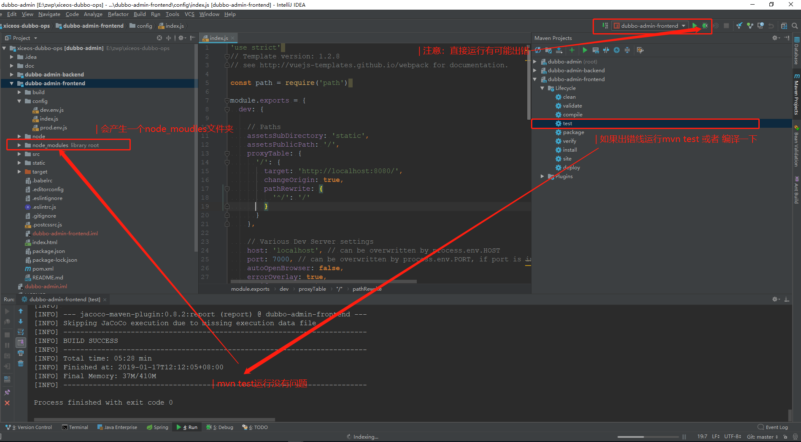

# Dubbo ops
> ops前后台分离、前台使用vue、后台使用springboot

## 运行前台工程`dubbo-admin-frontend`

注意：IDEA需要安装vue插件：https://github.com/JetBrains/intellij-plugins/tree/master/vuejs

> 01.工程导入.png

> 02.导入IDEA成功.png

> 03.maven刷新正常.png

> 04.配置IDEA运行vue项目.png

> 05.修改dubbo-admin-frontend运行时配置项.png

> 06.让IDEA支持vue中的js语法设置.png

> 07.运行dubbo-admin-frontend前台项目.png

> 08.运行dubbo-admin-frontend前台项目成功.png

> 09.dubbo-admin-frontend前台主页面.png

> 10.修改dubbo-admin-backend运行配置项.png

> 11.dubbo-admin-backend运行成功.png

